# DeutschFlow

**Speak German. See it translated. Keep what you learn.**

[](https://github.com/shareef01/deutschflow/actions/workflows/build.yml)


-3DDC84?logo=android)


DeutschFlow is an Android app for learning German through real speech. Language
apps tend to teach vocabulary in isolation; this one builds it from the user's own
voice. You talk to it in German, it transcribes what you said, translates it,
extracts the key vocabulary, and files everything into a personal library that
grows into flashcards, pronunciation practice and a daily word on the home screen.

Built with Kotlin and Jetpack Compose on a self-designed system called
*Obsidian & Azure*: true black, glass surfaces, one azure light source.

## Contents

- [Screenshots](#screenshots)
- [Features](#features)
- [Use cases](#use-cases)
- [Architecture](#architecture)
- [Security and privacy](#security-and-privacy)
- [Design system](#design-system)
- [Tech stack](#tech-stack)
- [Testing and CI](#testing-and-ci)
- [Getting started](#getting-started)
- [Project layout](#project-layout)
- [License](#license)

## Screenshots

| | |
| --- | --- |
| **Transcript** — speak, get a translation, save it | **History** — everything ever said, searchable |
| 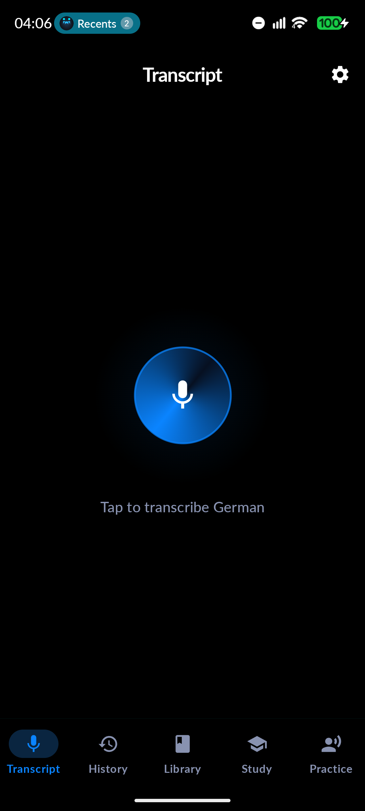 | 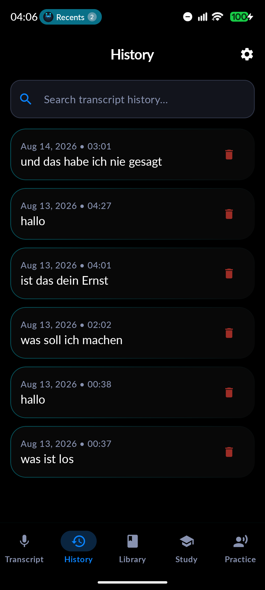 |
| **Library** — vocabulary from AI and by hand | **Word detail** — translation and the model's example |
| 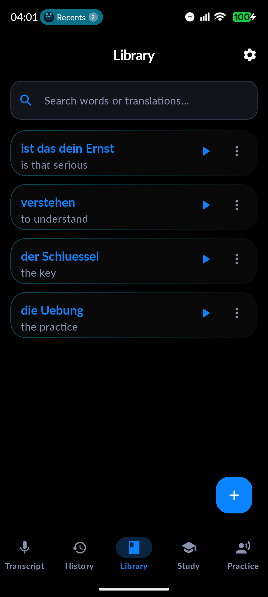 | 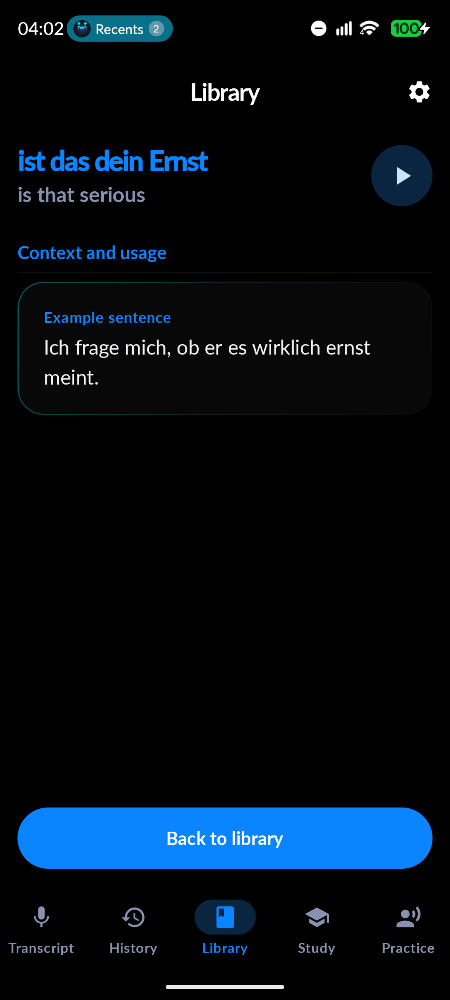 |
| **Study** — flashcards that earn XP and a streak | **Practice** — speak a sentence, get word-by-word scoring |
| 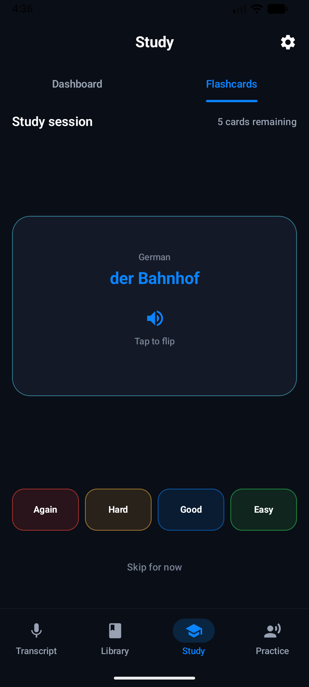 | 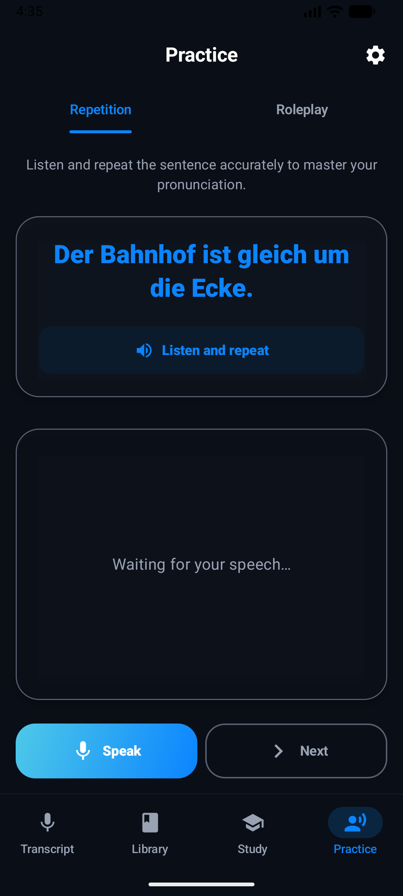 |
| **Settings** — API key, dialect, stats, privacy controls | **Daily word widget** — as shown in the system picker |
| 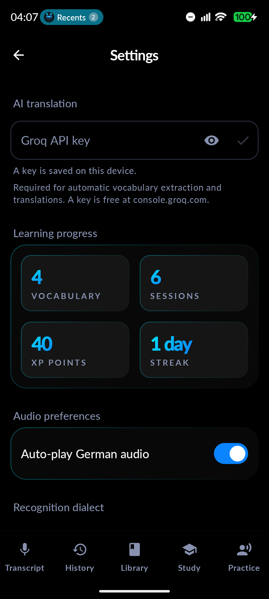 | 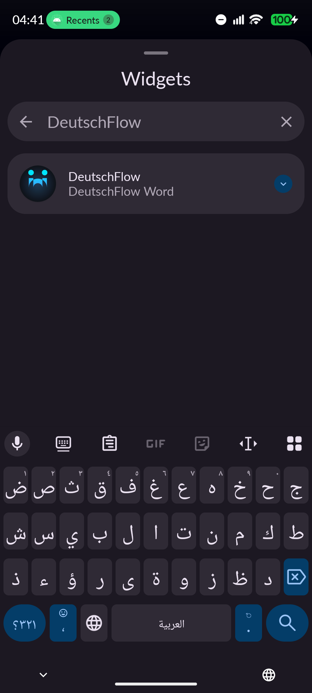 |

<p align="center">
  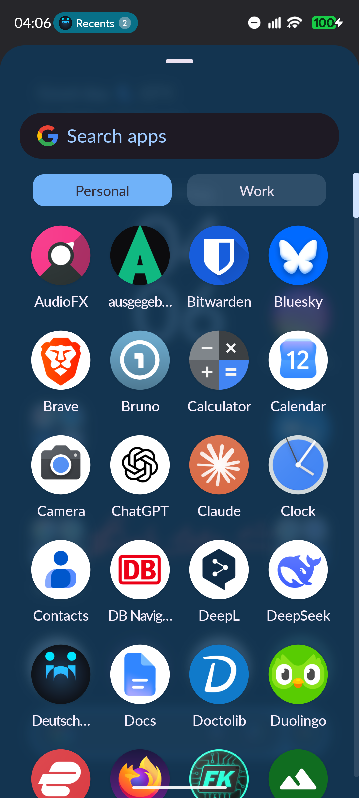
  <br>
  <em>The launcher icon — an Ü on a glass disc, with a themed-icon variant for Android 13+.</em>
</p>

## Features

**Speech and AI**
- On-device speech recognition (audio never leaves the device), with partial
  results, per-error guidance and a language-pack download trigger for devices
  without German recognition.
- Each utterance goes to Groq's chat-completions endpoint (Llama 3.3 70B), which
  returns a translation, 3–5 key vocabulary words and a natural example sentence.
  The client is hand-rolled on `HttpURLConnection` + `org.json` — zero HTTP
  dependencies.

**Learning**
- A library that accepts words from AI or typed by hand, with search, edit,
  delete and text-to-speech — fully offline once filled.
- Study mode: shuffled flashcards with a card-flip animation, autoplay, and an
  XP/streak system with atomic read-modify-write and once-per-session award
  tracking.
- Pronunciation practice with word-by-word scoring that is umlaut-tolerant
  (`Uebung` = `Übung`) and locale-safe.
- A daily word: WorkManager picks one word per day (deterministically, by date),
  posts it as a notification and keeps the Glance home-screen widget in sync.

**System**
- German or English UI with per-app language support (Android 13+) and
  `de-DE` / `de-AT` / `de-CH` dialect selection for recognition.

## Use cases

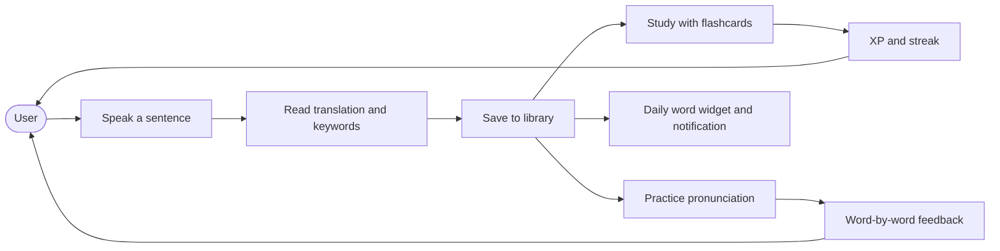

| Use case | Journey |
| --- | --- |
| **Understand something said to you** | Transcript → speak → read the translation → copy it or save the words you want to remember |
| **Build vocabulary from real life** | Every saved word keeps the model's example sentence; the library grows from what *you* actually heard |
| **Review with stakes** | Study shuffles the library into flashcards; each "Got it" banks 10 XP once per session and keeps the streak alive with calendar-day logic |
| **Train your pronunciation** | Practice picks a real sentence from your library, you repeat it, and each word is judged — tolerant of umlaut spelling variants |
| **Stay exposed daily** | At 09:00 the app posts the word of the day, and the widget shows the same word, chosen by date so every surface agrees |

## Architecture

Single-activity, MVVM, dependency injection via Hilt. The UI is pure Compose and
reads only `StateFlow`s; everything that touches the world lives behind a service
or a DAO, so the pure logic (parsing, scoring, streaks, daily-word selection) is
JVM-testable without Android.

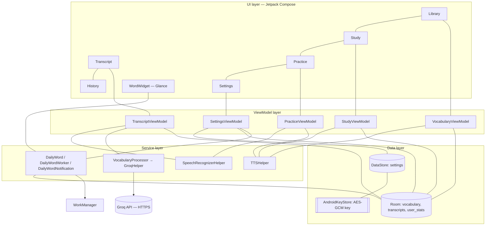

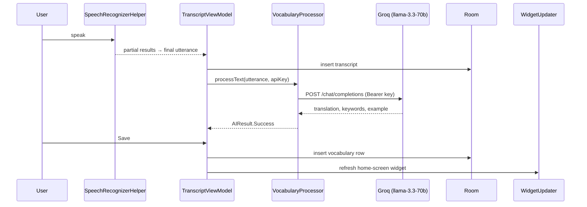

### Database

Room, version 4, with exported schemas and migrations validated by test. Release
builds have **no** destructive-migration fallback — a missing migration is a
failing test, not a wiped library.

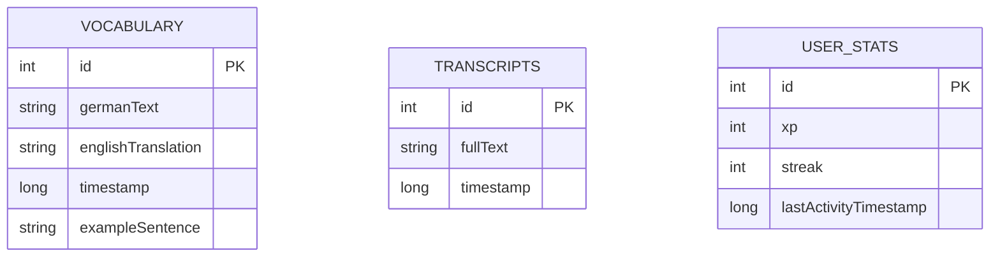

## Security and privacy

**The API key is the one secret, and it is treated like one.**
- Stored AES-GCM-encrypted under a key that lives in the **Android Keystore** and
  never enters the process; a fresh random IV per encryption, enforced by the
  Keystore itself.
- The DataStore file is **excluded from cloud backup and device transfer** — a
  restored copy would be undecryptable anyway, but a store of dead ciphertext is
  worse than no store.
- The key is **write-only** from the UI: Settings reports whether one exists but
  never reconstructs the plaintext into a text field, and the input is
  password-masked so password managers don't offer to "save" it.
- If encryption fails, the key is *not* written — there is no plaintext fallback,
  and the UI says so instead of claiming a save that didn't happen.
- Release builds strip `Log.d`/`Log.v` via R8, so no future logging mistake can
  leak a transcript or a key. Recognition content is never logged.

**The AI client is deliberately dependency-free.** `HttpURLConnection` +
`org.json` replace an archived Gemini SDK and its whole transitive payload. The
request is the OpenAI chat shape most providers speak, the user's transcript and
the system prompt travel in separate message roles, and the prompt tells the model
explicitly which wins — so a spoken sentence can't inject instructions.

**Concurrency is where the bugs lived, so the fixes are structural.** XP awards
run in a Room transaction with a one-shot read (a Flow read would leave the
transaction); a card awards once per session; the recognizer's results are a
`SharedFlow` so callers never read a previous session's text; the widget and the
notification pick the daily word through one date-deterministic selection,
ordered by id so two words saved in the same millisecond can't race.

**Details that matter to learners.** `Übung` and `Uebung` score as the same word
(German keyboards without umlauts produce the latter); `lowercase()` is
locale-invariant so a Turkish system locale can't break scoring; streaks compare
**calendar days in the device's zone**, not "24 hours apart".

## Design system

*Obsidian & Azure*, defined in `ui/theme/`:

- True black ground (`#000000` — an unlit OLED pixel), with surfaces drawn as
  **glass**: 3% white fill plus a 1dp azure border that falls off diagonally from
  the top-left corner — one light source for the whole app.
- One accent ramp: `AzureGlow #00E5FF → AzureDeep #0A84FF`. Everything that glows
  is a gradient between those two stops.
- One shape scale (8/12/16/20/28dp + pill), one type scale, one button language —
  and one theatrical element: the recording control, a breathing, rotating azure
  disc.
- Dark-only Material 3 theme, `en` + `de` localized, WCAG-checked muted colors
  (4.6:1 minimum for body text).

## Tech stack

| Concern | Choice |
| --- | --- |
| UI | Kotlin, Jetpack Compose, Material 3, navigation-compose, window size classes |
| DI | Hilt (including EntryPoints for the widget and the worker) |
| Persistence | Room (exported schemas, migrations 2→3→4), DataStore Preferences |
| Background | WorkManager (periodic daily word, `KEEP` policy) |
| Home screen | Glance app-widget |
| Networking | `HttpURLConnection` + `org.json` (no HTTP/JSON dependencies) |
| Speech | Android `SpeechRecognizer` (on-device), `TextToSpeech` |
| Build | Gradle 9.5, AGP 9.3, Kotlin 2.4, KSP2, version catalog, R8 + resource shrink |
| Platform | minSdk 31 (Android 12) / targetSdk 36 / compileSdk 37 |

## Testing and CI

- **45 JVM unit tests** for the pure logic: response parsing, pronunciation
  scoring, streak math, daily-word selection, worker delay, error extraction.
- **Instrumented suite** (CI, API 31 emulator): Room migration validation against
  historical schemas, DAO behavior, ViewModel state, and the API-key storage
  contract — including "the key never appears in the file on disk".
- **`GroqLiveTest`** proves the real request path against the real service once,
  using the device's own stored key, and skips rather than fails when no key is
  configured.
- GitHub Actions runs unit tests, lint and a full R8 **release build** on every
  push, and the instrumented suite on an emulator.

## Getting started

**Prerequisites**

- JDK 21
- Android SDK (the project resolves it via `local.properties`)

**Build**

```bash
./gradlew assembleDebug            # debug APK
./gradlew testDebugUnitTest lintDebug
./gradlew assembleRelease          # unsigned unless keystore.properties exists
```

Release signing is opt-in: drop a `keystore.properties` next to
`settings.gradle.kts` (storeFile/storePassword/keyAlias/keyPassword); it and
`*.jks` are gitignored.

**Install**

```bash
adb install -r app/build/outputs/apk/debug/app-debug.apk
```

**API key**

Translations need a free [Groq](https://console.groq.com) key. Install the app,
open **Settings → AI**, and paste it — it is encrypted at rest and never shown
again. Everything else (library, study, practice, widget) works without a key.

## Project layout

```
app/src/main/java/com/aus/deutschflow/
├── data/local/          Room entities, DAOs, migrations, KeystoreCipher, PreferenceManager
├── di/                  Hilt modules and EntryPoints
├── service/             speech, TTS, Groq client, daily word + worker + notification
├── ui/
│   ├── screens/         the six screens + dialogs
│   ├── components/      OracleMic, ErrorBanner, EmptyState, OnLeavingScreen
│   ├── navigation/      NavHost, tab/rail switching, Screen definitions
│   ├── viewmodel/       one ViewModel per screen
│   ├── widget/          Glance widget + updater
│   └── theme/           Obsidian & Azure design system
└── MainApp / MainActivity
```

## License

[MIT](LICENSE) — see the [LICENSE](LICENSE) file for details.
