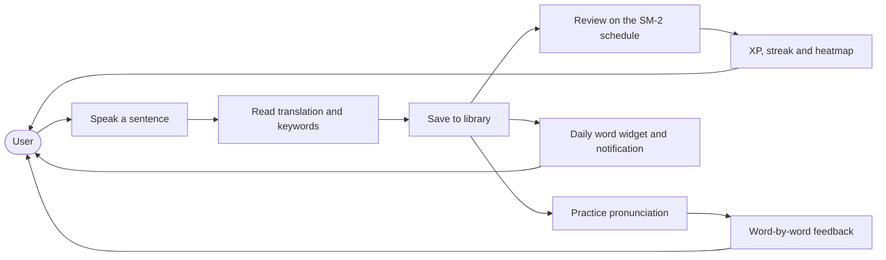
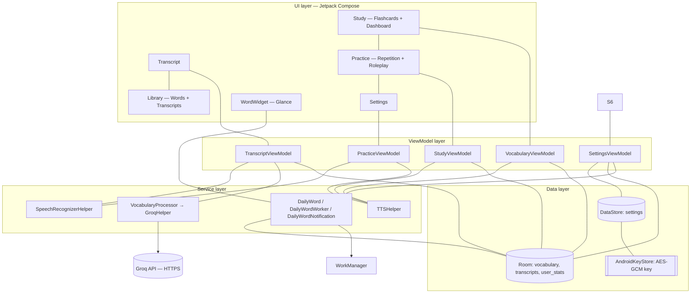
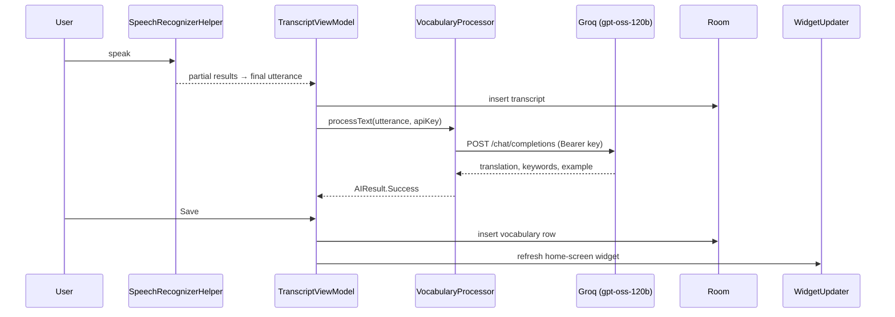
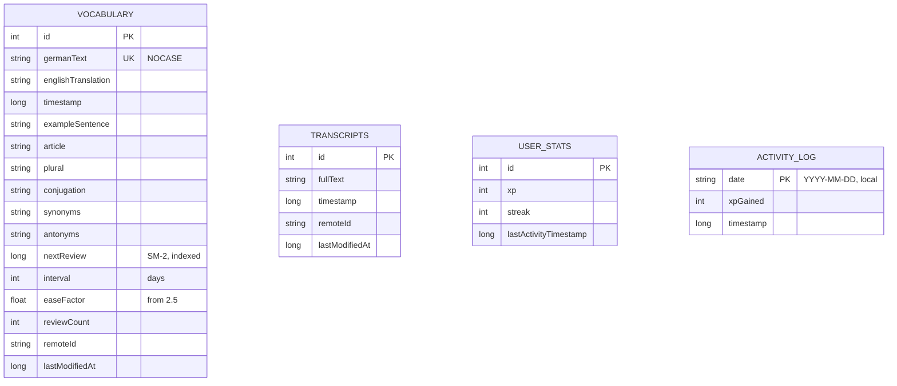

# DeutschFlow

**Speak German. See it translated. Keep what you learn.**

[](https://github.com/shareef01/deutschflow/actions/workflows/build.yml)


-3DDC84?logo=android)


DeutschFlow is an Android app for learning German from your own speech. Most
language apps hand you a word list; this one builds one out of what you actually
said. Speak a sentence, and the app transcribes it on-device, translates it, pulls
out the words worth keeping, and files them into a library that becomes spaced
repetition, pronunciation practice, and a word waiting on your home screen each
morning.

The idea is that vocabulary sticks better when it arrives attached to a moment you
remember — a sentence you were trying to say, not row 47 of a deck.

Written in Kotlin and Jetpack Compose, with a Next.js PWA in `web/` that mirrors
it screen for screen. Both run on a design system called *Obsidian & Azure*: a deep
blue-black ground, one azure accent, and no colour spent on decoration.

## Contents

- [Screenshots](#screenshots)
- [Features](#features)
- [Use cases](#use-cases)
- [Architecture](#architecture)
- [Security and privacy](#security-and-privacy)
- [The web app](#the-web-app)
- [Design system](#design-system)
- [Tech stack](#tech-stack)
- [Testing and CI](#testing-and-ci)
- [Getting started](#getting-started)
- [Project layout](#project-layout)
- [License](#license)

## Screenshots

Four tabs — one per verb: **speak**, **keep**, **recall**, **produce**.

| | |
| --- | --- |
| **Transcript** — speak, read the translation, keep the words worth keeping. The mic is anchored where your thumb is, on every state. | **Library · Words** — everything you've saved, searchable and sortable, with the model's example sentence on each entry. |
|  |  |
| **Library · Transcripts** — every session, grouped by day, swipe to delete with an undo. | **Word detail** — article, plural, conjugation, synonyms and antonyms for a single word. |
|  |  |
| **Study · Flashcards** — spaced repetition, graded *Again / Hard / Good / Easy*. The second pane is a dashboard: daily goal, streak, retention split and a three-month heatmap. | **Practice · Repetition** — repeat a sentence and get word-by-word scoring. The second pane is Roleplay, a short spoken exchange with an English gloss. |
|  |  |
| **Settings** — API key, recognition dialect, statistics and privacy controls. | |
|  | |

<p align="center">
  
  <br>
  <em>The daily word widget, as it appears in the system picker.</em>
</p>

<p align="center">
  
  <br>
  <em>The launcher icon — an Ü on a glass disc, with a themed-icon variant for Android 13+.</em>
</p>

## Features

**Speech and AI**
- On-device speech recognition through `createOnDeviceSpeechRecognizer` — audio
  never leaves the device, and the API is what enforces it rather than a hope
  about which service the phone happens to default to. Partial results, per-error
  guidance, and a language-pack download trigger for devices without German.
- Each utterance goes to Groq's chat-completions endpoint (`openai/gpt-oss-120b`), which
  returns a translation, 3–5 key vocabulary words and a natural example sentence.
  The client is hand-rolled on `HttpURLConnection` + `org.json` — zero HTTP
  dependencies.

**Learning**
- A library that takes words from the model or typed by hand, with search,
  sorting, edit, delete and text-to-speech — fully offline once filled. It shares
  a tab with your transcript history, because one holds what you said and the
  other the words taken from it.
- Spaced repetition on a SuperMemo-2 schedule. Each card is graded *Again / Hard /
  Good / Easy*, and the interval, ease factor and next due date move accordingly —
  so a word you know stops appearing and a word you don't comes back tomorrow. The
  same algorithm runs in both apps, pinned by an identical test table on each side
  after the two implementations quietly disagreed about rounding.
- A dashboard over that: daily XP goal, a streak counted in calendar days, a
  three-way retention split, and a heatmap of the last three months.
- Pronunciation practice with word-by-word scoring that is umlaut-tolerant
  (`Uebung` = `Übung`) and locale-safe, plus a conversational roleplay mode that
  holds a short exchange in German and glosses each reply in English.
- A daily word: WorkManager picks one per day deterministically by date, posts it
  as a notification and keeps the Glance home-screen widget showing the same word.

**System**
- German or English UI with per-app language support (Android 13+), and
  `de-DE` / `de-AT` / `de-CH` recognition selectable from Settings or from the
  chip on the Transcript screen itself.
- Accessibility is measured rather than assumed: every text/surface pairing is
  checked against WCAG in CI, every interactive element clears 48dp, the layout
  holds at 2× font scale, and the app honours the system's reduce-motion setting.

## Use cases



| Use case | Journey |
| --- | --- |
| **Understand something said to you** | Transcript → speak → read the translation → copy it, or keep the words you want |
| **Build vocabulary from real life** | Every saved word keeps the model's example sentence, so the library grows out of what *you* actually heard rather than a word list |
| **Review only what you're forgetting** | Study schedules each card on SM-2. Grade it *Again / Hard / Good / Easy* and the interval moves; a word you know stops appearing, a word you don't comes back tomorrow |
| **See whether it's working** | The dashboard shows the day's XP against a goal, a calendar-day streak, how much of the library is mastered versus still learning, and three months of activity |
| **Train your pronunciation** | Practice takes a real sentence, you repeat it, and each word is judged — tolerant of umlaut spelling variants |
| **Hold a conversation** | Roleplay keeps a short exchange going in German and glosses each reply in English |
| **Stay exposed daily** | At 09:00 the app posts the word of the day, and the widget shows the same one, chosen by date so every surface agrees |

## Architecture

Single-activity, MVVM, dependency injection via Hilt. The UI is pure Compose and
reads only `StateFlow`s; everything that touches the world lives behind a service
or a DAO, so the pure logic (parsing, scoring, streaks, daily-word selection) is
JVM-testable without Android.





### Database

Room, version 12, with exported schemas and every migration (2 through 12)
validated by an instrumented test that runs on an API 31 emulator in CI. Release
builds have **no** destructive-migration fallback — a missing migration is a
failing test, not a wiped library.

Version 12 exists for a subtler reason than a new column. Declaring SQL defaults
on `TranscriptEntity` fixed a real divergence — a database *migrated* into v11 had
them and one *created* at v11 did not — but it also changed the DDL Room hashes,
so a device already on v11 opened with a matching version, a mismatched identity
hash, and a crash before anything was drawn. `fallbackToDestructiveMigration` does
not soften that: the identity check throws regardless, which is the one mercy in
it, since nothing was wiped. `MIGRATION_11_12` is deliberately empty — only the
recorded hash was stale, and stepping the version is what lets Room rewrite it.

`germanText` is unique under a `NOCASE` collation, so a word is one row however
many times it is met; `MIGRATION_6_7` merged the duplicates that predate the
constraint field by field rather than picking a survivor.

Versions 8 to 11 carry the spaced-repetition work: `MIGRATION_7_8` added the SM-2
columns (`nextReview`, `interval`, `easeFactor`, `reviewCount`) and the index the
due-query reads, `MIGRATION_8_9` added synonyms and antonyms, `MIGRATION_9_10`
added the `activity_log` table behind the heatmap, and `MIGRATION_10_11` added
`remoteId` and `lastModifiedAt` to both content tables, backfilling a UUID for
every row that predates them.



`germanText` is indexed unique under `NOCASE`, `timestamp` is indexed because every
list orders by it, and `nextReview` is indexed because the study session's due-query
reads it. `activity_log` is keyed by a **local** calendar date, matching the streak
beside it — an ISO/UTC key would roll the heatmap over at the wrong hour for anyone
outside UTC.

## Security and privacy

**The API key is the one secret, and it is treated like one.**
- Stored AES-GCM-encrypted under a key that lives in the **Android Keystore** and
  never enters the process; a fresh random IV per encryption, enforced by the
  Keystore itself.
- The DataStore file is **excluded from cloud backup and device transfer** — a
  restored copy would be undecryptable anyway, but a store of dead ciphertext is
  worse than no store.
- The key is **write-only** from the UI: Settings reports whether one exists but
  never reconstructs the plaintext into a text field, and the input is
  password-masked so password managers don't offer to "save" it.
- If encryption fails, the key is *not* written — there is no plaintext fallback,
  and the UI says so instead of claiming a save that didn't happen.
- Release builds strip `Log.d`/`Log.v` via R8, so no future logging mistake can
  leak a transcript or a key. Recognition content is never logged.

**What does leave the device, stated plainly.** Audio never does —
`createOnDeviceSpeechRecognizer` binds the on-device engine specifically, rather
than the device's default recognition service, which on most phones is a
cloud one. The resulting *text* does, twice: each utterance is sent to
Groq for translation, and the Room database — which holds every transcript and
saved word — is included in Android's cloud backup and device transfer. Only the
settings DataStore is excluded from those, because it holds the API key. If the
transcript history is sensitive to you, turn off backup for DeutschFlow in Android's
settings, or clear it from **Settings → Clear all progress**.

**The AI client is deliberately dependency-free.** `HttpURLConnection` +
`org.json` replace an archived Gemini SDK and its whole transitive payload. The
request is the OpenAI chat shape most providers speak, the user's transcript and
the system prompt travel in separate message roles, and the prompt tells the model
explicitly which wins — so a spoken sentence can't inject instructions.

**Concurrency is where the bugs lived, so the fixes are structural.** XP awards
run in a Room transaction with a one-shot read (a Flow read would leave the
transaction); a card leaves the study queue when it is answered, so there is
nothing on screen to bank twice; the recognizer's results are a `SharedFlow` so
callers never read a previous session's text; the widget and the notification pick
the daily word through one date-deterministic selection, ordered by id so two words
saved in the same millisecond can't race.

**Details that matter to learners.** `Übung` and `Uebung` score as the same word
(German keyboards without umlauts produce the latter); `lowercase()` is
locale-invariant so a Turkish system locale can't break scoring; streaks compare
**calendar days in the device's zone**, not "24 hours apart".

**Where the web app's key protection stops.** The PWA mirrors the Keystore with
AES-256-GCM under a `CryptoKey` generated `extractable: false`, so the key material
cannot be exported and a copied browser profile is worth nothing. That is the whole
of what it buys. The key is still *usable* by any script on the origin, and the CSP
allows `script-src 'unsafe-inline'` because Next.js needs it for its bootstrap — so
the vault defends against disk and backup inspection, not against script injection.
Stated here rather than left to be inferred from the word "vault".

## The web app

`web/` is a Next.js PWA that ports the same screens, the same *Obsidian & Azure*
palette, and — more importantly — the same behaviours, particularly the ones that
were hard to get right: the recognizer publishes one utterance per recording, an AI
failure never reaches the translation field, the newest word interrogation wins, XP
is a single read-modify-write transaction, the streak compares calendar days, and
the SM-2 scheduler produces identical intervals to the Kotlin one. Room becomes
Dexie/IndexedDB, the Android Keystore becomes WebCrypto, and
`SpeechRecognizer`/`TextToSpeech` become the Web Speech API.

Keeping two implementations honest turns out to need enforcement rather than
intent, so `tools/palette_parity.py` diffs the palettes and both SRS engines assert
the same table of cases.

It is local-first in the same way the Android app is: every byte of user data
lives in IndexedDB, there is no server-side state, and the only network call is
the Groq request the client makes itself. A service worker precaches the shell, so
after one visit the installed app opens offline.

```bash
cd web
npm ci
npm run dev                       # http://localhost:3000
npm test                          # 75 unit tests (vitest)
npx tsc --noEmit && npm run build
npx playwright test               # 12 browser tests, including offline boot
                                  # and the access gate
```

Both apps are covered by the same GitHub Actions workflow.

## Design system

*Obsidian & Azure*, defined in `ui/theme/` and mirrored in `web/src/app/globals.css`:

- A deep blue-black ground (`#0A0E16`), not pure black. On OLED it is still very
  nearly an unlit pixel, but it leaves room for a surface to sit *below* the ground
  if it needs to recede, and a large empty area reads as a surface rather than a
  hole.
- One accent ramp: `AzureGlow #4EC9E8` → `AzureDeep #0A84FF`. The calm cyan is the
  listening state and every transcription accent; the electric blue is the primary
  action. Two stops of one ramp, so selection means the same thing wherever it is
  asked — chips, tabs, segments and the navigation bar all share it.
- A short spacing scale (4/8/16/24/32/40dp), one shape scale (8/12/16/20/24dp plus
  a pill), one type ramp with fixed weights and line heights, and named motion
  durations. Screens pick a role rather than a number.
- Dark-only Material 3, localized `en` + `de`, and honest about depth: the surface
  ramp is subtle enough that a card is only ~1.1:1 above the ground, so **the
  border does the separating** — `#565F70` at 3:1, the ratio WCAG asks of a
  boundary that identifies a component.
- Motion is restrained and optional. Durations come from `Motion.kt`, and
  `LocalReducedMotion` honours the system's animation scale — the first thing it
  disables is the halo that loops behind the record button while recording.

Two scripts in `tools/` keep this from drifting, and both run in CI:
`contrast.py` checks all 24 foreground/background pairings the app actually draws
against WCAG, reading the values straight out of `Color.kt`; `palette_parity.py`
compares the Android and web palettes token by token. The second exists because
they silently disagreed once — three colours corrected on Android for measured
contrast failures sat unchanged on the web until something looked.

## Tech stack

| Concern | Choice |
| --- | --- |
| UI | Kotlin, Jetpack Compose, Material 3, navigation-compose, window size classes |
| DI | Hilt (including EntryPoints for the widget and the worker) |
| Persistence | Room v12 (exported schemas, migrations 2→12), DataStore Preferences |
| Background | WorkManager (periodic daily word, `KEEP` policy) |
| Home screen | Glance app-widget |
| Networking | `HttpURLConnection` + `org.json` (no HTTP/JSON dependencies) |
| Speech | Android `SpeechRecognizer` (`createOnDeviceSpeechRecognizer`), `TextToSpeech` |
| Build | Gradle 9.5, AGP 9.3, Kotlin 2.4, KSP2, version catalog, R8 + resource shrink |
| Platform | minSdk 31 (Android 12) / targetSdk 37 / compileSdk 37 |

## Testing and CI

- **66 JVM unit tests** for the pure logic: response parsing, the SM-2 scheduler,
  pronunciation scoring, streak math, daily-word selection, worker delay, error
  extraction.
- **75 web unit tests** (vitest) plus a **12-case Playwright browser suite**
  covering every route, the responsive breakpoint, the language switch, offline
  boot, and the access gate — including that a forged session cookie is refused.
- **56 instrumented tests** (a device or an API 31 emulator): Room migration
  validation against every historical schema, DAO behaviour, ViewModel state, and
  the API-key storage contract — including "the key never appears in the file on
  disk".
- **Design-token checks in CI** — `tools/contrast.py` and `tools/palette_parity.py`
  fail the build on a WCAG regression or a palette that has drifted between the two
  apps.
- **`GroqLiveTest`** proves the real request path against the real service once,
  using the device's own stored key, and skips rather than fails when no key is
  configured.
- **`OnDeviceRecognitionTest`** proves recognition really is on-device: it runs a
  German session and asserts the engine bound, found the model and opened the
  microphone. It skips rather than fails where the capability is absent, so an
  emulator without on-device recognition does not turn the suite red.
- GitHub Actions runs all of it: unit tests, lint and a full R8 release build; the
  PWA's type check, unit tests and browser suite; and the instrumented suite on an
  API 31 emulator — minSdk, because that is where a migration is most likely to
  behave differently from the developer's own phone. Every job is bounded by
  `timeout-minutes`, after a hung browser install twice burned six hours on work
  that had nothing to do with it.

## Getting started

**Prerequisites**

- JDK 21
- Android SDK (the project resolves it via `local.properties`)

**Build**

```bash
./gradlew assembleDebug            # debug APK
./gradlew testDebugUnitTest lintDebug
./gradlew assembleRelease          # unsigned unless keystore.properties exists
```

Release signing is opt-in: drop a `keystore.properties` next to
`settings.gradle.kts` (storeFile/storePassword/keyAlias/keyPassword); it and
`*.jks` are gitignored.

**Install**

```bash
adb install -r app/build/outputs/apk/debug/app-debug.apk
```

**API key**

Translations need a free [Groq](https://console.groq.com) key. Install the app,
open **Settings → AI**, and paste it — it is encrypted at rest and never shown
again. Everything else (library, study, practice, widget) works without a key.

## Project layout

```
app/src/main/java/com/aus/deutschflow/
├── data/local/          Room entities, DAOs, migrations, KeystoreCipher, PreferenceManager
├── di/                  Hilt modules and EntryPoints
├── service/             speech, TTS, Groq client, daily word + worker + notification
├── ui/
│   ├── screens/         Transcript, Library (Words + Transcripts), Study, Practice, Settings
│   ├── components/      OracleMic, ErrorBanner, EmptyState, SegmentTab, OnLeavingScreen
│   ├── navigation/      NavHost, tab/rail switching, Screen definitions
│   ├── viewmodel/       one ViewModel per screen
│   ├── widget/          Glance widget + updater
│   └── theme/           Obsidian & Azure — colour, spacing, shape, type, motion
└── MainApp / MainActivity

web/
├── src/app/             the routes, grouped under the (app) shell
├── src/components/      AppShell, the glass UI kit, OracleMic
├── src/hooks/           one hook per screen — the ViewModel equivalents
├── src/lib/
│   ├── ai/              Groq client + VocabularyProcessor
│   ├── db/              Dexie schema, repository, settings, WebCrypto vault
│   └── speech/          Web Speech recognizer + TTS
├── public/sw.js         service worker: app-shell precache, offline boot
└── tests/               vitest units + the Playwright smoke suite
```

## License

[MIT](LICENSE) — see the [LICENSE](LICENSE) file for details.
