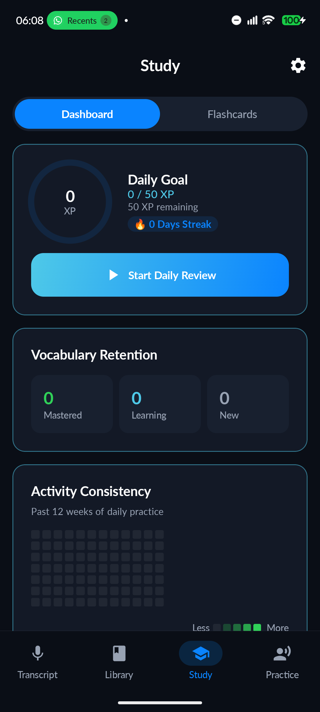

# DeutschFlow

DeutschFlow is a local-first German practice app for Android and the web: speak or type German, translate it with Groq, retain useful vocabulary, and review it with spaced repetition.

[](https://github.com/shareef01/deutschflow/actions/workflows/build.yml)


| Android | Web PWA |
| :---: | :---: |
|  |  |

## Features

- German speech transcription with selectable Germany, Austria, and Switzerland dialects
- Groq-powered translation, grammar notes, vocabulary extraction, and roleplay
- Local vocabulary library with German-aware duplicate handling
- SM-2-derived spaced repetition, XP, streaks, and pronunciation shadowing
- Persistent roleplay conversations and text input when browser speech is unavailable
- English and German UI, responsive navigation, light/dark system themes, and offline-capable PWA shell
- Android daily-word notification and home-screen widget
- Manual JSON export/import for web learning data

## Architecture

DeutschFlow contains two independent clients. They share product behavior and test contracts, not runtime source.

### Android

The native app uses Kotlin, Jetpack Compose, Material 3, MVVM/UDF, Hilt, Room, DataStore, WorkManager, and Glance. Room schema migrations are exported under `app/schemas` and tested against historical versions. Speech uses Android's on-device recognizer; text-to-speech uses the platform TTS engine.

### Web

`web/` is a Next.js PWA using React, TypeScript, Tailwind CSS, Dexie, IndexedDB, Vitest, and Playwright. The service worker caches the application shell and same-origin static assets. The Next.js access gate runs in `src/proxy.ts`, the Next.js 16 replacement for the deprecated `middleware.ts` convention.

### Shared behavior

The clients keep their implementations idiomatic to each platform. Cross-platform JSON fixtures exercise SRS, streak, normalization, and data-contract behavior where practical. `tools/audit_repo.py` checks translation parity, palette parity, contrast, and repository hygiene.

## Privacy model

DeutschFlow does not operate account-based cloud sync.

- Android learning data is stored in the local Room database. Android OS cloud backup and device transfer are enabled for that database, so the operating system may copy learning data according to the device/account backup settings.
- The Android settings DataStore is excluded from OS cloud backup and device transfer. Groq API keys are encrypted with AES-GCM under Android Keystore; failed legacy-key migration is reported and does not delete the recoverable key or downgrade new writes to plaintext.
- Web learning data and preferences are stored in the browser's IndexedDB. Browsers may evict site data, so use the manual backup feature. A previously loaded app shell and IndexedDB data may remain available in that browser profile even after a network session expires.
- Web API keys are encrypted with AES-GCM under a non-extractable WebCrypto key stored in IndexedDB. This protects copied storage at rest, but JavaScript running on the same origin must be able to decrypt the key to call Groq.
- Text submitted for translation, grammar analysis, or roleplay is sent to Groq with the user's API key. Audio is not sent to Groq.
- Android explicitly requests the on-device speech recognizer. Availability depends on the device and installed language model.
- Browser speech recognition is vendor-provided and may send audio to the browser vendor. Firefox currently falls back to typed roleplay because it does not expose the required Web Speech recognition API.
- Neither client includes an analytics SDK, advertising SDK, or crash reporter.

## Repository structure

```text
app/                    Android application, unit tests, instrumentation tests, Room schemas
web/                    Next.js PWA, Vitest tests, Playwright tests
app/src/test/resources/ Shared behavioral fixtures consumed by Kotlin and TypeScript tests
docs/screenshots/       Product and Playwright visual baselines
tools/                  Repository, contrast, and palette checks
.github/workflows/      CI
```

## Requirements

- Git
- JDK 21
- Android Studio with Android SDK Platform 37
- Node.js 22 and npm
- Android 12 / API 31 or newer for the app
- A Groq API key for AI features

## Android setup

```bash
git clone https://github.com/shareef01/deutschflow.git
cd deutschflow
./gradlew assembleDebug
```

Open the project in Android Studio or install `app/build/outputs/apk/debug/app-debug.apk`. Add a Groq API key in **Settings**. Speech recognition additionally requires microphone permission and an available on-device German model.

Useful Android checks:

```bash
./gradlew testDebugUnitTest
./gradlew lintDebug
./gradlew assembleDebug assembleRelease
./gradlew connectedDebugAndroidTest   # requires a running API 31+ emulator/device
```

The release build is unsigned unless local signing configuration is supplied.

## Web setup

```bash
cd web
npm ci
```

Create `web/.env.local`:

```dotenv
SITE_PASSWORD=choose-a-long-random-password
SESSION_SECRET=replace-with-at-least-32-random-bytes
```

Generate a signing secret with a cryptographically secure tool, for example:

```bash
openssl rand -base64 32
```

Then run:

```bash
npm run dev
```

Open <http://localhost:3000>. Enter the site password, then add the Groq API key in the app's Settings page. Groq credentials are user data and must not be placed in `NEXT_PUBLIC_*` variables.

### Environment variables

| Variable | Required | Purpose |
| --- | --- | --- |
| `SITE_PASSWORD` | Yes | Authenticates access to the deployed instance |
| `SESSION_SECRET` | Yes | Independent HMAC key for session cookies |
| `VERCEL_GIT_COMMIT_SHA` | Vercel-provided | Stable build/cache identifier |

The access cookie is HttpOnly, Secure in production, SameSite=Lax, path-scoped to `/`, and expires after 30 days. Rotating `SESSION_SECRET` invalidates every existing session. Redirect targets are restricted to local application paths.

Login throttling is intentionally small and process-local. It returns an immediate cooldown response rather than sleeping a server invocation. It limits naive guessing on one long-lived process, but serverless instances do not share counters and cold starts reset them. Use a high-entropy password; deploy an external durable rate limiter only when the hosting architecture provides one cleanly.

## Web testing

```bash
npm run lint
npm run typecheck
npm test
npm run build
npx playwright install chromium firefox webkit
npm run test:e2e
```

Chromium runs the full browser and visual suite. Firefox and WebKit run compatibility and speech-fallback smoke coverage. Visual assertions compare against `docs/screenshots/web` with deterministic animation/caret settings and retain Playwright diffs in the HTML report.

To intentionally refresh reviewed visual baselines:

```bash
npx playwright test visual-audit.spec.ts --project=chromium --update-snapshots
```

## Backup and import

The web Settings page exports versioned JSON containing vocabulary, transcripts, XP/streak statistics, and daily activity. API keys, UI preferences, and the current roleplay conversation are excluded.

Import uses additive merge semantics:

- local rows absent from the backup remain;
- stable record IDs prevent duplicate imports;
- German-equivalent vocabulary keys merge;
- an SRS schedule is kept as a coherent set rather than mixing dependent fields;
- XP never decreases;
- streak and last-activity state are recomputed from merged activity history;
- malformed, oversized, unsupported-version, or invalid-calendar data is rejected transactionally.

Android has no manual JSON import/export feature. Its Room data may participate in Android OS backup and device transfer as described above.

## Security

- Session authentication and session signing use independent secrets.
- Password and signature checks use length-safe constant-time comparisons.
- The app fails closed when either web access-gate secret is absent.
- Security headers include CSP, frame denial, MIME-sniffing protection, Referrer-Policy, and Permissions-Policy.
- The CSP permits only same-origin application resources and the Groq API connection. Next.js currently requires inline bootstrap/style allowances for this static offline architecture; the app does not render untrusted HTML or load third-party scripts.
- The service worker never intercepts Groq POST requests and does not cache login redirects under private application routes.
- GitHub Actions use minimal read permissions and SHA-pinned actions. Dependabot covers Gradle, npm, and workflow actions.

Do not commit `.env.local`, API keys, passwords, signing keys, or generated credentials.

## CI

The GitHub Actions workflow runs:

- repository parity/contrast/hygiene audit;
- Android unit tests, lint, and release compilation;
- web lint, type checking, unit tests, production build, and browser tests;
- Android instrumentation tests on the minimum supported API plus targeted modern-platform coverage;
- report and Playwright artifact uploads even on failure.

## Known limitations

- AI translation and roleplay require network access, a user-supplied Groq key, and the configured Groq model remaining available.
- Browser speech support and privacy characteristics vary by vendor; typed roleplay remains available without recognition.
- The PWA is local-first, not a synchronization service. Clearing or losing browser site data without an export loses the web library.
- Process-local login throttling is not a globally consistent serverless rate limit.
- Android hardware-backed Keystore storage depends on device capabilities.

## Development workflow

Keep data migrations backward-compatible and add a regression test for every fixed invariant. Run `python tools/audit_repo.py`, both platform unit suites, relevant browser/instrumentation tests, and production builds before opening a pull request. Update visual baselines only after reviewing the diff.

## License

DeutschFlow is available under the [MIT License](LICENSE).
