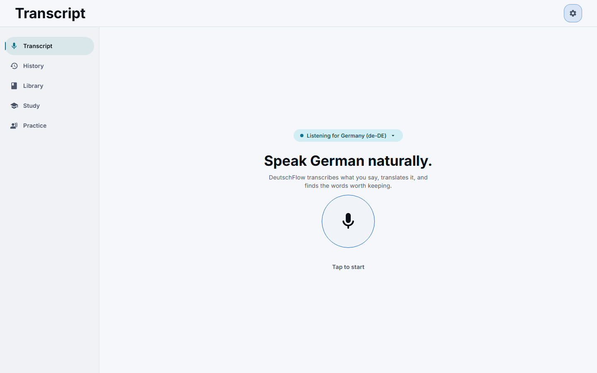
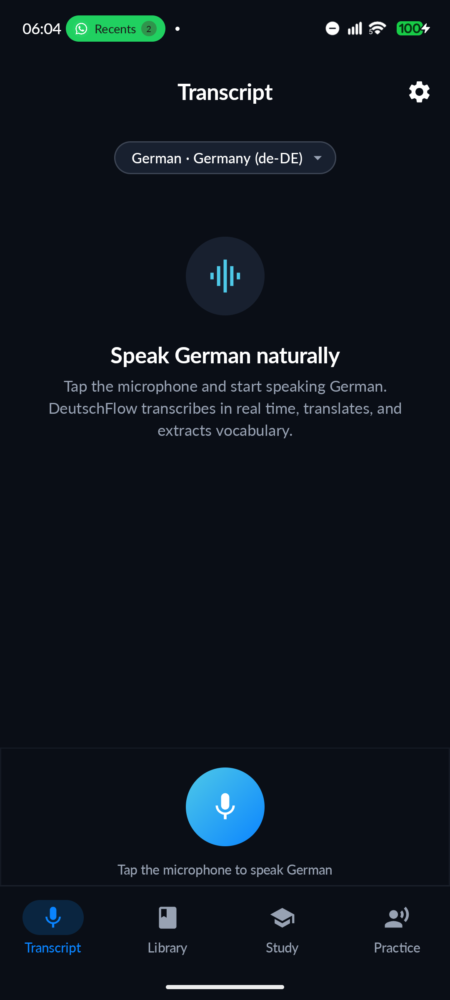
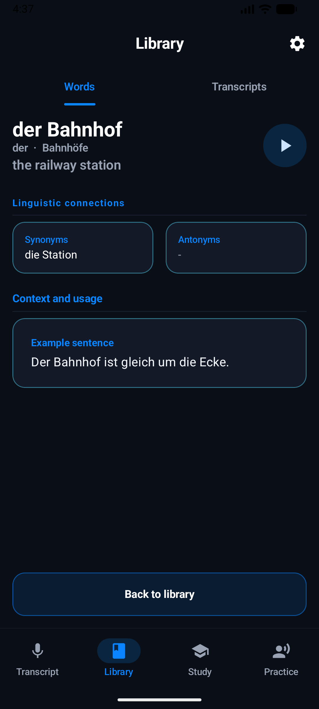
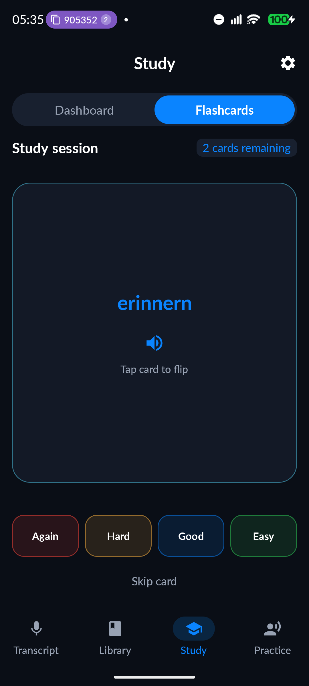
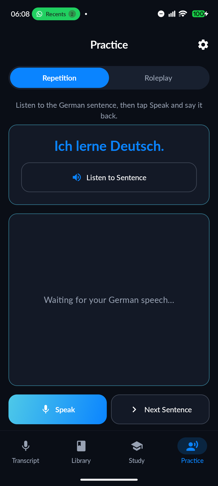
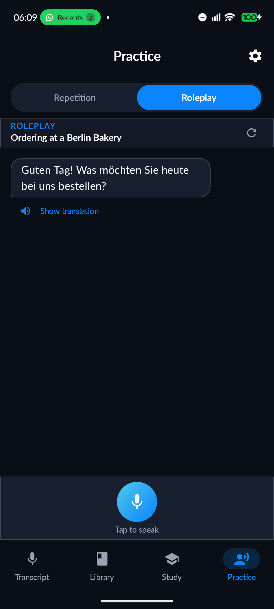
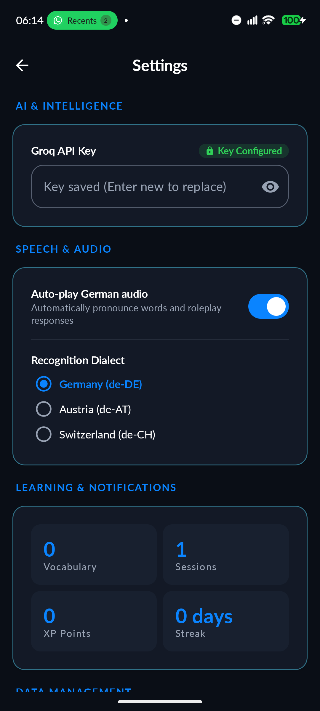

# DeutschFlow

A local-first, privacy-respecting German language practice app for Android and the Web. Speak or type German, translate it with Groq AI, retain useful vocabulary, and master it with spaced repetition.

[](https://github.com/shareef01/deutschflow/actions/workflows/build.yml)
-3DDC84?logo=android&logoColor=white)

[](LICENSE)

<p align="center">
  
  &nbsp;&nbsp;&nbsp;&nbsp;
  
</p>

DeutschFlow bridges the gap between passive consumption and active speaking. It pairs instant on-device speech transcription with low-latency Groq AI translations, deep grammatical breakdowns, interactive situational roleplay, and an SM-2 spaced repetition review deck.

The project features two independent, production-grade clients—a native **Android** app (Jetpack Compose & Room) and an installable **Web PWA** (Next.js & IndexedDB)—both adhering to a shared cross-platform domain contract without shared runtime source code.

---

## 📸 Key Interfaces

| Real-Time Transcription | Vocabulary Library | Linguistic Word Detail | Spaced Repetition Study |
| :---: | :---: | :---: | :---: |
| <br><sub><b>Transcription & Translation</b><br>Real-time speech capture with dialect selection</sub> | <br><sub><b>Vocabulary Library</b><br>Saved words, search, and German audio playback</sub> | <br><sub><b>Word Spotlight</b><br>Grammar gender, forms, synonyms & example context</sub> | <br><sub><b>Spaced Repetition</b><br>SM-2 scheduling with 4-tier retention grading</sub> |

| Pronunciation Shadowing | AI Situational Roleplay | Progress Dashboard | Privacy & Settings |
| :---: | :---: | :---: | :---: |
| <br><sub><b>Pronunciation Shadowing</b><br>Sentence repetition with intelligibility scoring</sub> | <br><sub><b>AI Roleplay</b><br>Contextual dialogues (e.g. bakery, clinic, transit)</sub> | <br><sub><b>Learning Dashboard</b><br>Daily XP goal, streak tracking & activity heatmap</sub> | <br><sub><b>Settings & Privacy</b><br>On-device voice selection, CEFR level & key vault</sub> |

---

## ✨ Core Features

- **🎙️ Speech Transcription**: Multi-dialect German recognition (`de-DE`, `de-AT`, `de-CH`). Android explicitly binds the on-device recognizer for offline transcription privacy.
- **⚡ AI Intelligence & Grammar Breakdown**: Groq-powered translations (`openai/gpt-oss-120b`), grammatical gender indicators (`der`, `die`, `das`), case identification (`Nominativ`, `Akkusativ`, `Dativ`, `Genitiv`), contextual examples, and configurable CEFR levels (`A1` through `C1+`).
- **💬 Situational AI Roleplay**: 8 curated real-world conversational scenarios (Bakery, Café, Hotel, Doctor, Train Station, Apartment Viewing, Job Interview, Small Talk) with automatic opening prompts and contextual translations.
- **🧠 Spaced Repetition (SRS)**: SuperMemo-2 (SM-2) derived algorithm with 4-tier grading (*Again*, *Hard*, *Good*, *Easy*), daily XP goals, streak calculations, and immutable review event history.
- **🗣️ Pronunciation Shadowing**: Word-level intelligibility comparison with Unicode-aware tokenization and automatic German letter folding (`ü` $\rightarrow$ `ue`, `ß` $\rightarrow$ `ss`, apostrophe contractions).
- **📚 Local Vocabulary Library**: Additive vocabulary storage, fast search, audio pronunciation playback, and custom phrase management.
- **🔒 Privacy-First Architecture**: Audio never leaves the phone on Android; API credentials stay encrypted at rest via hardware-backed Android Keystore or WebCrypto IndexedDB. Zero third-party telemetry, ads, or analytics.
- **📱 Android Integrations**: Glance home-screen widget and periodic daily-word notification via WorkManager.
- **🌐 Offline-Ready PWA**: Responsive application shell with service-worker caching, keyboard navigation, password-gated deployment, and JSON backup export/import.

---

## 🏗️ Architecture

DeutschFlow maintains two independent clients that share domain behavior and test contracts rather than runtime source code:

```text
deutschflow/
├── app/                        Android native application (Kotlin, Jetpack Compose, Room)
│   ├── schemas/                Versioned Room database schemas (versions 2–16)
│   └── src/test/resources/     Shared cross-platform behavioral contract fixtures
├── web/                        Progressive Web App (Next.js 16, React 19, TypeScript, Dexie)
│   └── tests/                  Vitest unit/contract tests and Playwright E2E suites
├── docs/screenshots/           Curated mobile screenshots and Playwright visual baselines
└── tools/                      Static repository audit, WCAG contrast, and palette parity tools
```

### Android Architecture
- **Language & Toolchain**: Kotlin 2.4, Android Gradle Plugin 9.4, KSP 2.3, compileSdk 37, targetSdk 37, minSdk 31 (Android 12+).
- **UI & Architecture**: 100% Jetpack Compose with Material 3, MVVM / Unidirectional Data Flow (UDF), Hilt dependency injection, Navigation Compose with adaptive navigation bar/rail.
- **Persistence**: Room 2.8 database (version 16) with strict migrations and immutable entity representations. Settings stored via Jetpack DataStore Preferences.
- **Speech & Audio**: Android `SpeechRecognizer` using `createOnDeviceSpeechRecognizer` with `EXTRA_PREFER_OFFLINE`; platform `TextToSpeech` with automatic preference for on-device voices (`!voice.isNetworkConnectionRequired`).
- **Security**: AES-GCM encryption under Android Keystore for API keys.

### Web Architecture
- **Framework & Libraries**: Next.js 16 (App Router), React 19, TypeScript 5.8, Tailwind CSS 4.
- **Persistence**: IndexedDB via Dexie 4 (schema version 8) supporting additive merge and JSON backup portability.
- **Authentication**: Zero-external-dependency access gate via `src/proxy.ts` (Next.js 16) with timing-safe HMAC-SHA256 session tokens.
- **Security & Audio**: AES-GCM encryption with non-extractable WebCrypto keys; Web Speech API with automatic local voice preference (`voice.localService === true`).
- **Testing**: Vitest for unit/contract tests; Playwright for cross-browser (Chromium, Firefox, WebKit) and visual regression testing.

### Shared Behavioral Contract
Both clients execute identical test suites against a shared JSON contract fixture (`app/src/test/resources/cross-platform-contract.json`). This ensures parity across:
- SuperMemo-2 mathematical scheduling intervals, review counts, and ease factors.
- German key folding and Unicode normalization (`NFC`, umlauts, eszett, apostrophes).
- Practice tokenization and word intelligibility evaluation.
- Groq AI payload constraints, token thresholds, and strict JSON output parsing.

---

## 🔒 Privacy & Security Model

DeutschFlow is designed around local-first data ownership:

- **Audio Privacy (Android)**: Speech recognition explicitly requests `createOnDeviceSpeechRecognizer`. When the device has the German offline speech pack installed, audio is transcribed on-device and never transmitted over the network.
- **Audio Privacy (Web)**: Browser speech recognition uses the platform's Web Speech API, which delegates to the browser vendor (Google for Chrome/Edge, Apple for Safari; Firefox falls back to text input). The in-app Settings screen clearly documents this difference.
- **Speech Synthesis (TTS)**: Both clients query available voices and prioritize on-device voices to ensure synthesized German audio remains local whenever possible.
- **AI Processing**: When configured with a user-provided Groq API key, only text prompts (transcriptions, sentences, or roleplay lines) are sent to Groq via HTTPS. Audio is never sent to Groq.
- **Local Storage**: All learning history, flashcards, transcripts, and stats reside on your device (Room SQLite on Android; IndexedDB on Web).
- **Encrypted Keys**: API keys are encrypted at rest with AES-GCM—using hardware-backed Android Keystore on Android, and a non-extractable WebCrypto key in IndexedDB on Web.
- **Zero Telemetry**: No analytics SDKs, advertising libraries, tracking pixels, or third-party crash reporters are bundled in either client.

---

## 🚀 Getting Started

### Prerequisites

- **Git**
- **JDK 21** (Temurin recommended)
- **Android Studio** (Ladybug / Meerkat or newer) with **Android SDK Platform 37**
- **Node.js 22+** and **npm** (for web development)
- **Groq API Key**: Optional for core UI and practice; required for AI translation, grammar notes, and roleplay. Obtain a free key at [console.groq.com](https://console.groq.com/).

---

### Android Setup

1. **Clone the repository:**
   ```bash
   git clone https://github.com/shareef01/deutschflow.git
   cd deutschflow
   ```

2. **Build and install:**
   ```bash
   ./gradlew assembleDebug
   ```
   Open the repository in Android Studio or install `app/build/outputs/apk/debug/app-debug.apk` directly onto an Android 12+ (API 31+) device or emulator.

3. **Configure API Key:**
   - Tap the Settings icon (`⚙️`) in the top bar.
   - Enter your Groq API key.
   - *(Optional)* Select your preferred CEFR level (`A1`–`C1+`) and recognition dialect (`de-DE`, `de-AT`, `de-CH`).

#### Useful Android Commands

```bash
./gradlew testDebugUnitTest          # Run unit and contract tests
./gradlew lintDebug                  # Run Android lint
./gradlew assembleRelease            # Compile unsigned release APK
./gradlew connectedDebugAndroidTest  # Run on-device instrumentation tests (API 31+ required)
```

---

### Web PWA Setup

1. **Navigate to the web workspace:**
   ```bash
   cd web
   npm ci
   ```

2. **Configure environment:**
   Create a `.env.local` file inside `web/`:
   ```dotenv
   SITE_PASSWORD=choose-a-long-random-password
   SESSION_SECRET=replace-with-at-least-32-random-bytes
   ```
   *Tip: Generate a random secret with `openssl rand -base64 32`.*

3. **Run development server:**
   ```bash
   npm run dev
   ```
   Open [http://localhost:3000](http://localhost:3000), enter your `SITE_PASSWORD`, and enter your Groq API key in Settings.

#### Useful Web Commands

```bash
npm run lint         # ESLint check (zero-warning policy enforced)
npm run typecheck    # TypeScript compiler check (tsc --noEmit)
npm test             # Vitest unit and domain contract tests
npm run build        # Production Next.js build
npm run test:e2e     # Playwright cross-browser tests
```

---

## 🧪 Quality & Verification

Every push and pull request is validated by [GitHub Actions](.github/workflows/build.yml):

- **Static Repository Audit**: `python tools/audit_repo.py` enforces:
  - 1:1 parity between English and German strings across Android (`strings.xml`) and Web (`i18n.ts`).
  - Palette parity between Kotlin and Tailwind color definitions.
  - WCAG 2.1 contrast compliance for all light and dark theme token pairings (`tools/contrast.py`).
  - Repository hygiene rules (detecting accidental temporary files or debug artifacts).
- **Android Quality**: Automated unit tests, domain contract tests, Room migration walk (v2 through v16), and Android lint.
- **Web Quality**: ESLint, TypeScript compiler checks, Vitest test suite, production build, and Playwright browser regression tests.

---

## 💾 Backup & Data Portability

- **Web Library Backup**: In the Web app under **Settings $\rightarrow$ Backup**, export your entire learning history (vocabulary, transcripts, review events, XP, and streaks) to a versioned JSON file.
- **Additive Import**: Importing a backup file safely merges records:
  - Existing local cards and transcripts are preserved.
  - Matching German vocabulary entries merge linguistic metadata without resetting SRS progress.
  - XP never decreases, and activity streaks are deterministically recomputed.
- **Android Backup**: The Room database participates in standard Android OS cloud backup and device-to-device transfer. Keystore-encrypted settings and API keys are deliberately excluded from cloud backup to protect credentials.

---

## 📄 License

DeutschFlow is open-source software licensed under the [MIT License](LICENSE).
