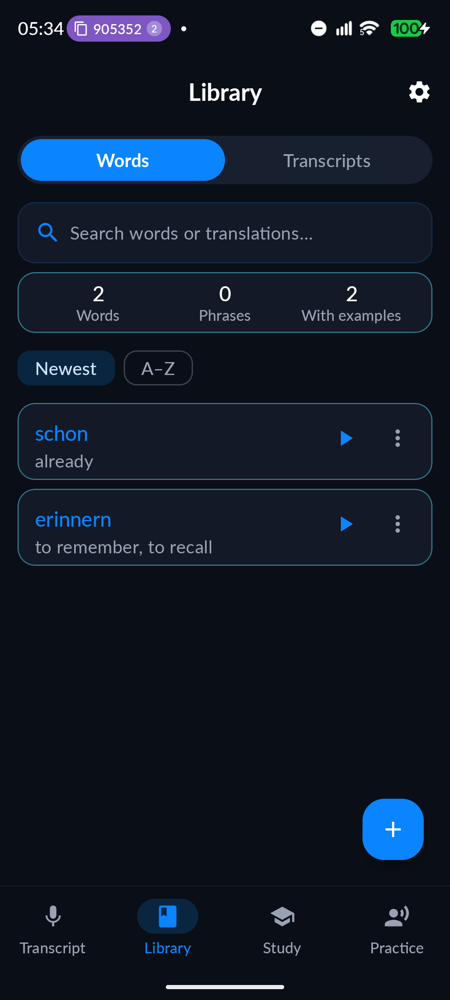
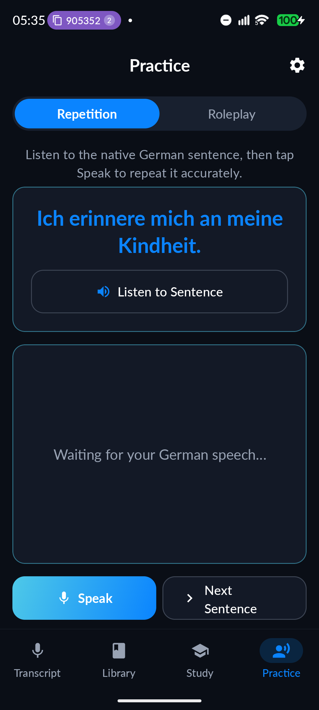

# DeutschFlow

**Speak German. See it translated. Keep what you learn.**

[](https://github.com/shareef01/deutschflow/actions/workflows/build.yml)


-3DDC84?logo=android)


DeutschFlow is a modern, native Android application designed for learning German contextually. Instead of memorizing static, disconnected word lists, DeutschFlow builds a personalized vocabulary library derived directly from what you speak in real life.

Speak a sentence in German, and the app transcribes it on-device in real time, translates it, extracts key vocabulary with grammatical cases and genders, and schedules those words for spaced repetition and pronunciation shadowing practice.

---

## 📸 Key Interfaces

| 📚 Vocabulary Library & Filters | 🧠 Spaced Repetition (SM-2) Flashcards |
| :---: | :---: |
|  |  |

| 🗣️ Pronunciation Shadowing & Roleplay | 🕓 Transcript History |
| :---: | :---: |
|  |  |

<!-- The Transcript screen has no shot here: the file that used to fill that cell
     was not the app at all, it was a phone's app drawer, and it is gone. A
     replacement needs capturing on a device seeded with sample data. -->

---

## ✨ Core Features

- **🎙️ On-Device Speech Recognition:** Powered by `createOnDeviceSpeechRecognizer` with multi-dialect support (Germany `de-DE`, Austria `de-AT`, Switzerland `de-CH`). Instant transcription with full offline privacy.
- **⚡ AI Grammar Spotlight & Translation:** Integrated with Groq AI (`gpt-oss-120b`) to provide instantaneous English translations, grammatical gender/case breakdowns (`der/die/das`, `Akkusativ`, `Dativ`), and contextual example sentences.
- **🧠 Spaced Repetition System (SRS):** SM-2-derived scheduling with 4-tier grading (*Again*, *Hard*, *Good*, *Easy*), capped at a one-year interval, plus daily XP goal tracking. *Good* and *Easy* follow SM-2 exactly; *Hard* shortens the interval rather than resetting it, and *Again* returns the card to the current session.
- **🗣️ Shadowing & AI Roleplay:** Speak a sentence and see, word by word, which words the recogniser heard — umlaut spellings folded, so `Uebung` matches `Übung`. This measures recall and intelligibility, not phoneme-level pronunciation: the platform speech APIs expose no per-phoneme confidence. Paired with interactive situational roleplay scenarios.
- **🔒 Keystore-Backed Security:** API credentials encrypted via AES-GCM hardware-backed Android Keystore.
- **🎨 Material 3 UI:** Fluid animations, spring interaction feedback, and dynamic scroll fading edges. Light and dark, following the system setting on both platforms — there is no in-app override to fall out of sync with it. Both palettes are verified against WCAG contrast thresholds in CI, and checked to agree across the two apps (`tools/contrast.py`, `tools/palette_parity.py`).

---

## 🏗️ Architecture & Tech Stack

```
com.aus.deutschflow
├── data/local
│   ├── AppDatabase.kt, Migrations.kt   (Room, v12, no destructive fallback)
│   ├── dao/                            (Vocabulary, Transcript, UserStats, Activity)
│   ├── entities/                       (the four tables)
│   ├── PreferenceManager.kt            (DataStore)
│   └── KeystoreCipher.kt               (AES-GCM under the Android Keystore)
├── service
│   ├── SpeechRecognizerHelper.kt       (on-device STT)
│   ├── TTSHelper.kt                    (native TTS, with audio focus)
│   ├── SRSEngine.kt                    (SM-2-derived scheduler)
│   ├── GroqHelper.kt                   (AI translation, grammar, roleplay)
│   ├── VocabularyProcessor.kt          (the seam the tests substitute)
│   ├── DailyWord.kt, DailyWordWorker.kt, DailyWordNotification.kt
│   └── SyncManager.kt, CloudService.kt (stubs — no backend yet)
├── ui
│   ├── components/                     (design system, SegmentedTabs, ErrorBanner)
│   ├── screens/                        (Transcript, Library, History, Study,
│   │                                    Dashboard, Practice, Roleplay, Settings)
│   ├── theme/                          (colour tokens, spacing, typography, motion)
│   ├── viewmodel/                      (StateFlow, coroutines, MVVM)
│   ├── navigation/                     (NavHost, adaptive bar/rail)
│   └── widget/                         (Glance home-screen widget)
└── di                                  (Hilt modules and entry points)
```

- **UI:** 100% Jetpack Compose with Material 3.
- **Architecture:** MVVM + Unidirectional Data Flow (UDF).
- **Concurrency & Reactivity:** Kotlin Coroutines & `StateFlow`.
- **Dependency Injection:** Hilt.
- **Storage:** Room SQLite Database + Jetpack DataStore.

---

## 🚀 Getting Started

### Prerequisites
- Android Studio Ladybug / Meerkat or newer.
- JDK 21, and Android SDK Platform **37** (`compileSdk`/`targetSdk` are both 37; `minSdk` is 31 / Android 12).
- Physical Android device or Emulator with Google Play services (for the on-device speech model).

### Installation
1. **Clone the repository:**
   ```bash
   git clone https://github.com/shareef01/deutschflow.git
   cd deutschflow
   ```
2. **Build and Run:**
   ```bash
   ./gradlew assembleDebug
   ```
3. **Configure API Key (Optional):**
   - Open **Settings** inside the app (`⚙️` icon in top-right).
   - Enter your [Groq API Key](https://console.groq.com/) for instant AI translations and grammar notes.

### The web app (`web/`)

The repository also holds a Next.js PWA — a second, independent implementation of
the same product, deployed to Vercel. It shares no source with the Android app;
the two are kept in step by hand, and `tools/palette_parity.py` fails CI if their
colour tokens drift.

```bash
cd web
npm ci

# Every route is behind a password gate, so this must be set or the app will
# redirect to /login with nothing that can get past it.
export SITE_PASSWORD='choose-a-long-random-string'

npm run dev        # http://localhost:3000
npm test           # Vitest
npm run typecheck  # tsc --noEmit
npm run build      # production build
npx playwright test  # browser smoke suite (needs `npx playwright install chromium`)
```

---

## 🔒 Privacy

- **Android speech recognition runs on the device.** `SpeechRecognizerHelper` binds
  `createOnDeviceSpeechRecognizer` specifically — not the system default, which on
  most phones streams audio to Google. Audio never leaves the phone.
- **Web speech recognition does not.** The browser's Web Speech API delegates to the
  vendor: Chrome and Edge send the captured audio to Google, Safari to Apple, and
  Firefox does not implement it at all. There is no offline hint the page can set.
  The Settings screen says so; this is the one privacy property where the two
  clients genuinely differ.
- **Transcripts are sent to Groq** for translation, grammar analysis and roleplay —
  the text only, never the audio, and only when you have supplied an API key.
- **Everything else stays local.** Vocabulary, history, XP and streak live in Room
  on Android and in IndexedDB on the web. There is no telemetry, no analytics SDK,
  no crash reporter and no third-party script in either client. Cloud sync is a
  stub: nothing is uploaded.
- **Your API key** is encrypted with AES-GCM — under the hardware-backed Android
  Keystore on the phone, and under a non-extractable WebCrypto key in the browser.
  Note the browser case is weaker by nature: the page must decrypt the key to send
  it, so any script on the origin could read it. See the header of
  `web/src/lib/db/vault.ts`.
- **Back up the web library.** IndexedDB is the only copy, and browsers may evict
  it. Settings → Backup writes the whole library to a JSON file.

---

## 📄 License

Distributed under the [MIT License](LICENSE).
