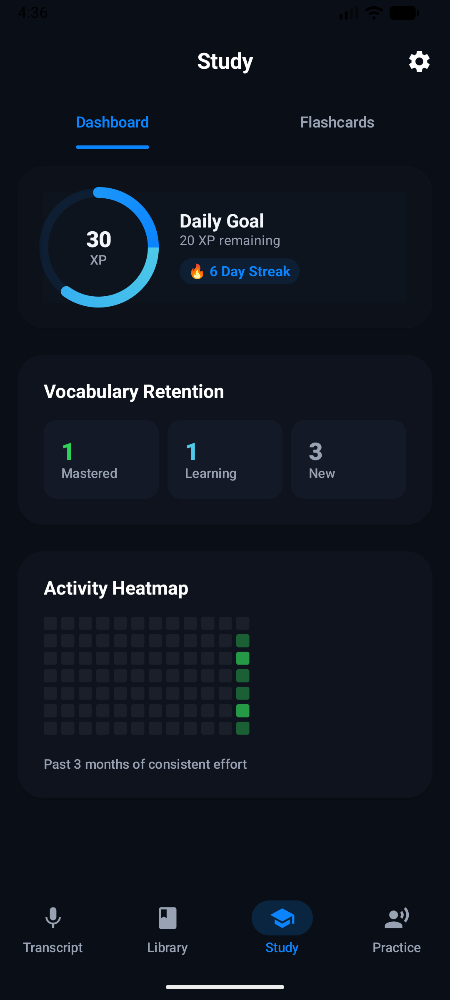

# DeutschFlow

**Speak German. See it translated. Keep what you learn.**

[](https://github.com/shareef01/deutschflow/actions/workflows/build.yml)


-3DDC84?logo=android)


DeutschFlow is a modern Android application designed for learning German contextually. Instead of memorizing static word lists, DeutschFlow builds a personalized vocabulary library based on what you actually say. 

Speak a sentence in German, and the app transcribes it on-device, translates it, extracts key vocabulary, and schedules those words for spaced repetition and pronunciation practice.

---

## 📸 Screenshots

| Transcript & Translation | Vocabulary Library | Spaced Repetition Study | Dashboard & Statistics |
| :---: | :---: | :---: | :---: |
|  |  |  |  |

| History | Word Details | Practice & Roleplay | Settings |
| :---: | :---: | :---: | :---: |
|  |  |  |  |

---

## ✨ Key Features

- **On-Device Speech Recognition:** Powered by `createOnDeviceSpeechRecognizer`, ensuring privacy and speed. Audio never leaves your device.
- **AI-Powered Translations:** Integrates with Groq's `gpt-oss-120b` endpoint to provide natural translations, grammar notes, and contextual example sentences.
- **Spaced Repetition System (SRS):** Built-in SuperMemo-2 scheduling algorithm to help you review vocabulary exactly when you're about to forget it.
- **Pronunciation Practice & Roleplay:** Word-by-word pronunciation scoring and AI-driven conversational roleplay.
- **Daily Widgets:** A home-screen Glance widget that serves you a new word from your library every morning.
- **Privacy First:** AES-GCM encryption backed by the Android Keystore secures your API keys.

## 🏗️ Architecture & Tech Stack

Built on modern Android development standards:
- **UI:** 100% Jetpack Compose with Material 3.
- **Architecture:** MVVM (Model-View-ViewModel) + Clean Architecture principles.
- **Concurrency & State:** Kotlin Coroutines and `StateFlow` for reactive, thread-safe UI updates.
- **Dependency Injection:** Hilt.
- **Local Persistence:** Room Database for vocabulary and transcripts; DataStore for preferences.
- **Networking:** Lightweight, dependency-free `HttpURLConnection` to interact with AI endpoints.

## 🚀 Getting Started

1. **Clone the repository:**
   ```bash
   git clone https://github.com/shareef01/deutschflow.git
   ```
2. **Open the project** in Android Studio (Jellyfish or newer recommended).
3. **Build and Run:** Sync Gradle and deploy to an emulator or physical device running Android 12 (API 31) or higher.
4. **API Key:** To use translations, supply a Groq API key inside the app's settings screen.

## 📄 License

This project is licensed under the [MIT License](LICENSE).
